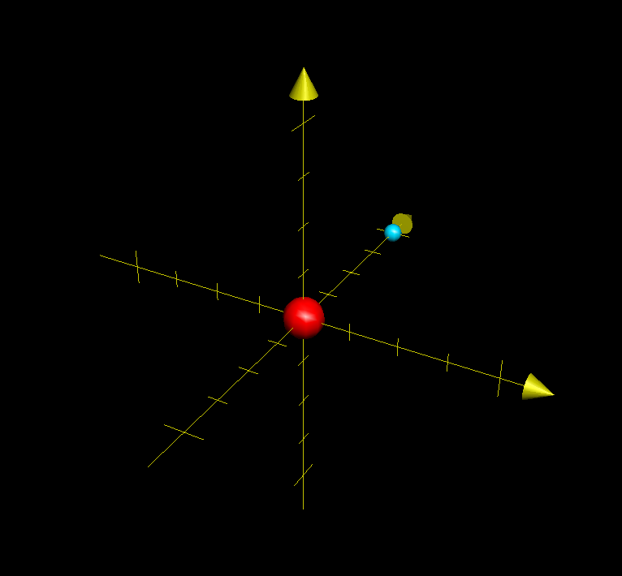

# イントロダクション

## 目標

このコースでは、太陽系・太陽系外の恒星そして太陽系内外へ向かう探査機をコンピューターの
画面上に描画するシミュレーターを作成することを最終目標としています。

まずは、私たちが暮らしている地球がある太陽系とその位置をどのように表すかについてを考えます。

## 太陽系

太陽系には、以下の主要な天体が存在します。

- 恒星
    - 太陽
- 惑星
    - 水星
    - 金星
    - 地球
    - 火星
    - 木星
    - 土星
    - 天王星
    - 海王星
- 準惑星
    - 冥王星

これらの惑星・準惑星は、太陽の回りを公転しています。

## 天体を表す座標系

地球上では、東西南北を使って方向を表すことができますが、宇宙上では何か基準を作って方向や距離を表す必要があります。

この方法は1つではなく、いくつかの方法があります。

### 天球

地球から空を見上げた時、太陽、月、そして様々な天体を観察することができます。
その空を、観測している人を中心として書いた仮想的な球面を「天球」と呼びます。

天球を利用した座標系を「天球座標系」と呼びます。

### 地平座標

私たちが、空を観察する上で、最もわかりやすく表現できる方法が「地平座標」と呼ばれる方法です。
方位 (東西南北)と、高度から表されます。

方位は、南を0°として、時計回り (西回り) に360°までの数値で表します。
高さは地平線を0°、真上を90°とします。(地平線より下の星を示す場合は、マイナスとなるようです。)

この座標系は、地球から見た、それぞれの星を表すときには利用できるのですが、
観測地点、観測時刻などに依存してしまうため、天体の位置を表すための座標としては適切ではありません。

### 赤道座標

地平座標と比べて、星の絶対的な座標として赤道座標があります。

地球の天球を表した時、自転軸の北側を北に伸ばして天球と交わらせた点を「天の北極」と呼びます。反対が側は「天の南極」です。
天球をちょうど上下半分に割る線が、赤道になります。

この北、南を表すのが赤緯と呼ばれるものです。(δ: デルタの小文字で表されます)
赤道面を0°として、天の北極を90°、点の南極を-90°で表現します。

横方法は赤経という単位で表します。(α: アルファの小文字で表されます)
春分点 (後述) を 0°として、反時計回りで360°を表現します。
360° = 24時間 である24時制を取るルールとなっており、15° = 1時、15' = 1分, 15'' = 秒 として表現されます。

### 黄道座標 (こうどうざひょう)

地球の天球から見て太陽の通り道を「黄道」と呼びます。この線を基準にした座標系が黄道座標系です。

赤道に対して、黄道は23.26°傾いています。これが、地軸の傾きです。

黄道座標では縦方向は黄緯(β: ベータの小文字で表されます。)と表します。
北極側には「りゅう座」があり、90°で表されます。南極側には「かじき座」があり、-90°で現れます。

赤道と黄道がちょうど交わる点が、1年のうちで2点あり、1点が春分点で、もう一つが秋分点です。
 
赤道座標と同じく、反時計回りで360°を表現します。
これを黄経(λ: ラムダの小文字で表されます)と呼びます。赤経と同じく、24時制を利用して表現します。

この座標系は、太陽系の他の天体を表現するのに便利なため、このコースではこの座標系を使うことが多いです。

赤道座標・黄道座標の関係図 [1](#note1)

### 銀河座標

太陽系を表現する場合は、地球や太陽を中心とした赤道座標・黄道座標を使えば良いのですが、
より広い範囲を見たい時に使うのが銀河座標です。銀河の中心にある、いて座Aを基準とした座標です。

2000年1月1.5日時点 (J2000.0) の基準だと、赤経12h51m26.282s、赤緯+27°07'42.01"を
北極して表現します。この縦方向の表現を銀緯(b)と呼びます。地球から見て北極を+90°で、
南側を-90°で表現します。

一方で横方向は、いて座Aの方向を0°として、反時計回りに数値を増やしていきます。
これは銀経(l)と呼びます。

## 直交座標へ

NASAなどが出している情報は、黄道座標などを計算するためのものです。
一方で、コンピューター上で天体を表現するために、ある原点からの横縦奥行きの距離を出す必要があります。(x, y, z)

このコースでは、まずは黄道座標を求め、その後に (x, y, z) で表される直交座標へ変換します。

春分点をx方向で+とします。また、直交座標における1は、太陽と地球の距離とします。
太陽と地球の距離は「天文単位」とよび、auという単位がつきます。(現在の定義では 1au = 149,597,870,700m)

例: 理論的な座標の例 図は、中心を太陽、水色の球体を地球で表しています。

春分:

- 地球における黄道座標 (λ, β) = (0h, 0°)
- 太陽を原点して考えた直交座標 (x, y, z) = (1, 0, 0)

夏至:

- 地球における黄道座標 (λ, β) = (6h, 23° 26')
- 太陽を原点して考えた直交座標 (x, y, z) = (0, 0, 1)

秋分:

- 地球における黄道座標 (λ, β) = (12h, 0°)
- 太陽を原点して考えた直交座標 (x, y, z) = (-1, 0, 0)

冬至:

- 地球における黄道座標 (λ, β) = (18h, -23° 26')
- 太陽を原点して考えた直交座標 (x, y, z) = (0, 0, -1)

# 注釈

- 1 https://ja.wikipedia.org/wiki/%E6%98%A5%E5%88%86%E7%82%B9 から引用

# 参考文献・引用

- 長谷川一郎 『[天文計算入門](https://www.amazon.co.jp/%E5%A4%A9%E6%96%87%E8%A8%88%E7%AE%97%E5%85%A5%E9%96%80%E2%80%95%E4%B8%80%E7%90%83%E9%9D%A2%E4%B8%89%E8%A7%92%E3%81%8B%E3%82%89%E8%BB%8C%E9%81%93%E8%A8%88%E7%AE%97%E3%81%BE%E3%81%A7-%E9%95%B7%E8%B0%B7%E5%B7%9D-%E4%B8%80%E9%83%8E/dp/4769908180)』 恒星社, 新装版 2015年 (初版1978年) , pp. 33 - 54

# 参考URL

- [国立天文台 計算室 暦象年表](http://eco.mtk.nao.ac.jp/koyomi/cande/)
