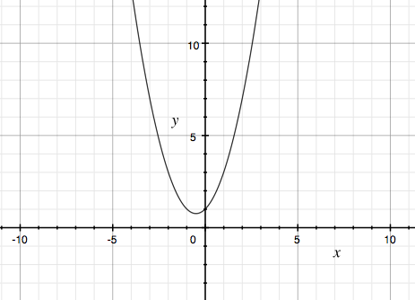
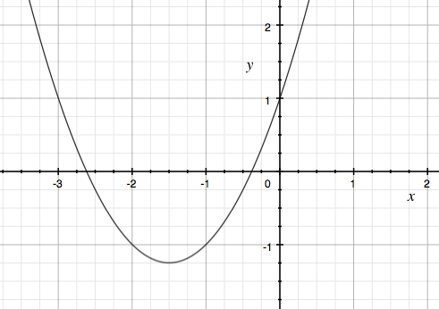

# 天体計算に必要な数学: 方程式の近似値を解く

## 微分

微分とは、ある関数における変化の割合を求める操作です。
ある関数で軌道が求められるとして、その瞬間の移動速度を求める場合などに利用します。

また、コンピュータ上で方程式を解く時に、微分を使うことで求められる場合があります。

実際にどのように微分を行うか確かめます。

以下のような二次関数があったとします


この関数をグラフで描画すると、以下のようになります。



この関数のyの変化量を確認します。
x=0 のときは、y=1, x=1 のときは y=3です。それぞれの変数の変化量を⊿(デルタ)で表します。

```
⊿x=2 (3-1)
⊿y=1 (1-0)
```

この時、⊿yを⊿xで割った数を変化の割合と呼びます。上記の場合の変化の割合は2です。

xの変化量を小さくします。x=0.5の時は、y=1.75です。従って

```
⊿x=0.5
⊿y=0.75
変化の割合 1.5
```

さらに小さくします。

x=0.25のときは、y=1.3125です。変化の割合は1.25です。

このxの変化量を限りなく0に近くしていった時に、変化の割合は1に近い数になります。

この変化の割合を求める関数を求める操作が微分です。

微分の操作は簡単に行うことが出来ます。


の関数があった場合、それぞれの次数(2乗、3乗など)を1つ引いて、元々の次数をそれぞれの項に掛けるだけです。
この操作により求められた関数を導関数と呼び、以下のように記述します。


または以下のように記述する場合もあります。


この関数を使うことで、x時点のの瞬間的な変化の割合を求めることが出来ます。

x = 0のとき、y' = 1 になるので、先程検証した数と同じになります。

### NOTE: 導関数の求め方

導関数を求める際に、なぜ次数を下げて掛けるだけで良いのかというと以下が成立するためです。

xの変化量が限りなく0に近くなったとすると、hを変化量として以下のような式を考えることが出来ます。


最終的にhは0になるので、残った 2x+1が導関数ということになります。


## ニュートン法

コンピューターで方程式の解を求める方法は多数存在しますが、代用的なものがニュートン法です。

問題の起点として、コンピューターを利用して、


を満たす x の近似値を求めたいとします。グラフで見る限り -1 と 0 の間にありそうです。



この時、以下の方法で求めることができます。

1. 適当な値を決めてxとする。例) x=0
2. 方程式の右辺を関数f(x)として、その導関数f'(x)を作る。例) 
3. f(x) / f'(x) を求める。 例)
   
   0.333.. が求まる
4. 最初に決めた値から 3で求めた値を引き、新たなxとする 例) 0 - 0.333.. = -0.333
5. 4で求めた新しいxを使い、3〜5の操作を繰り返す。この操作は、前回の計算結果の差が小さくなるまで十分な回数繰り返す。

計算の精度にも依存しますが、以下のように徐々に変化がなくなり収束していきます。これにより、方程式の解を求めることが可能です。

```
1回目: -0.3333333333
2回目: -0.380952381
3回目: -0.3819655522
4回目: -0.3819660113
```

4回目で算出された値で、関数の結果が0になるかを確かめましょう。

```
-0.3819660113 * -0.3819660113 + -0.3819660113 * 3 + 1 = -1.156831e-10 (-0.000000000156831)
```

わずかながら誤差はありますが、ほぼ0になるxを見つけることができました。

# 参考URL

- [ニュートン法 - Wikipedia](https://ja.wikipedia.org/wiki/%E3%83%8B%E3%83%A5%E3%83%BC%E3%83%88%E3%83%B3%E6%B3%95)
- [ニュートン法 - パソコンで数値計算](http://pc-physics.com/newtonhou1.html)
