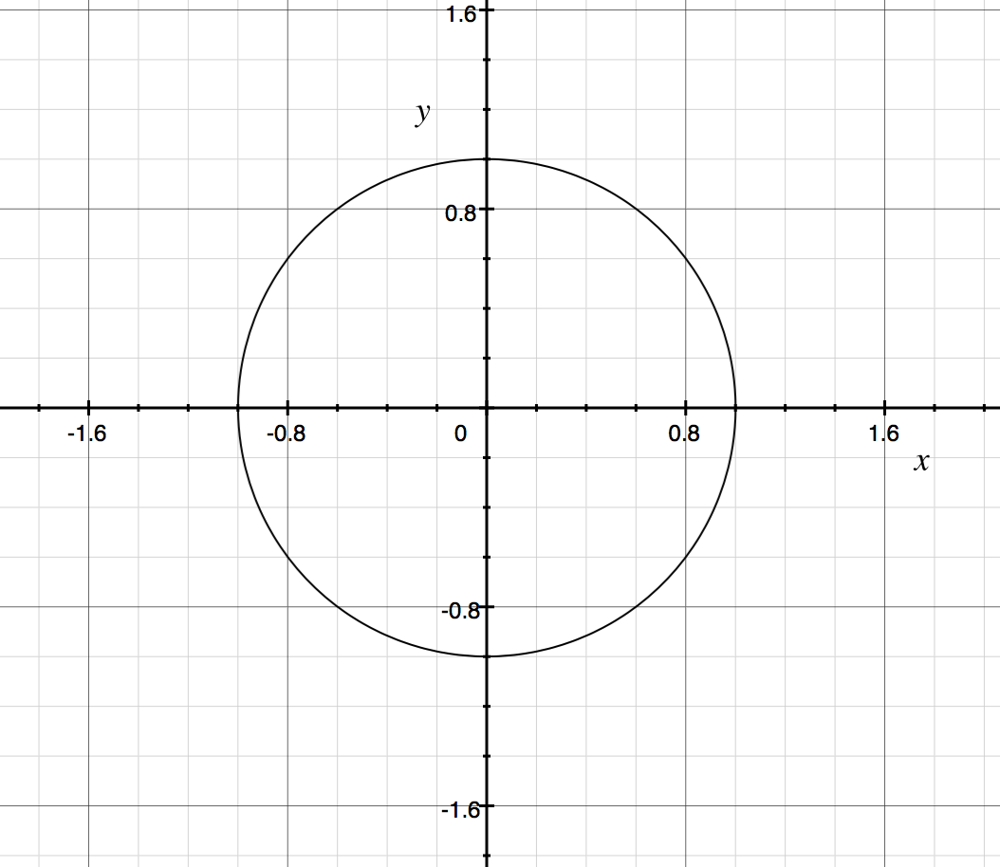
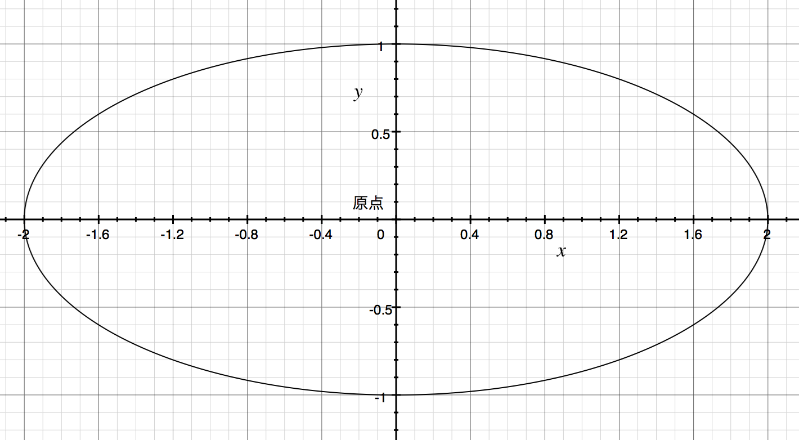
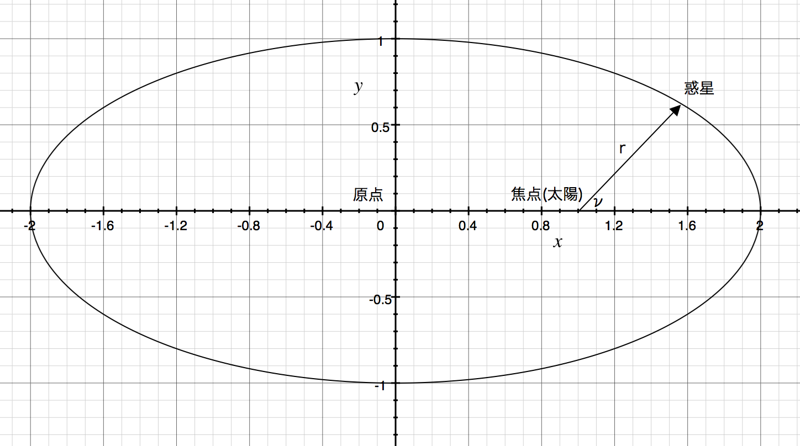
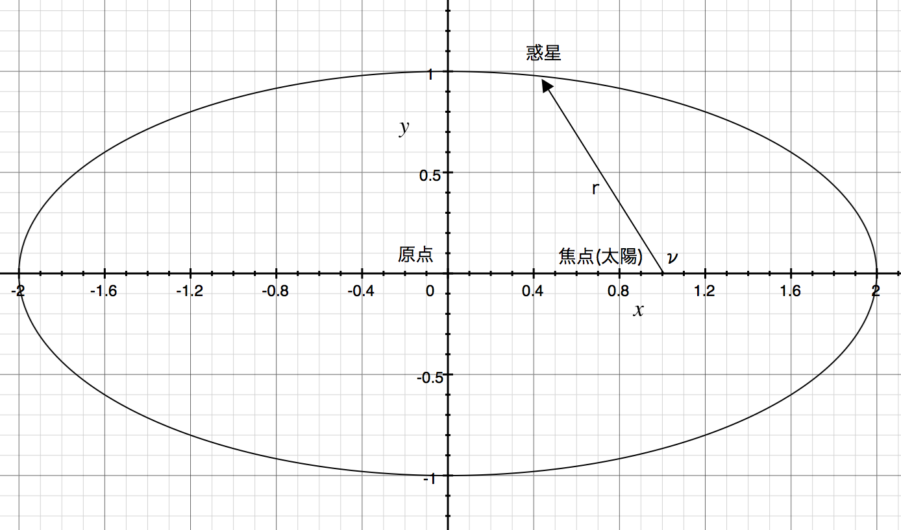
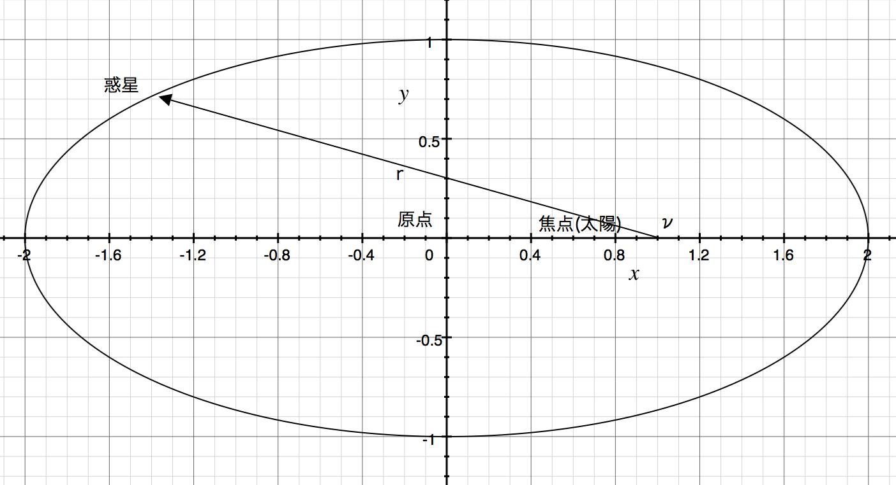
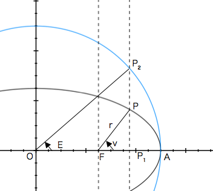

# 天体計算に必要な数学: 楕円

ケプラー (1571 - 1630) は、天体の観測を行い恒星の回りを周る惑星には3つの法則があることを発見しました。

1. 楕円軌道の法則: 惑星は、太陽をひとつの焦点とする楕円軌道上を書く
2. 面積速度一定の法則: 惑星と太陽を結ぶ線分が時間単位に書く面積は、一定である。
3. 調和の法則: 惑星の公転周期の2乗は、軌道の半長径の3乗に比例する。

これらの法則を軌道計算に応用するための要素を学びましょう。

また、実際に利用するデータには「近日点」「離心率」といった用語が出てきます。
これらは楕円軌道における各種変数となりますので、この回で説明します。

## 円の方程式と楕円の方程式

太陽の回りを太陽が周る時、太陽を中心に1周回ります。この運動を円運動と呼びます。
ケプラーの法則発見以前は、恒星の回りに円を描くと考えられてきました。

2次元平面上に円を書く時は以下の表すことが出来ます。

r = 半径

OS X に標準に付属する Grapher に数式を入れて確かめましょう。半径1の場合はr = 1となり、

という方程式となります。例えば、xが1の場合、

となります。

xが0.5の場合は、

となり、プラスとマイナスに2点とります。

## 楕円の方程式の利用

惑星の軌道は円ではなく楕円(ケプラーの第一法則より)なので楕円の方程式を利用します。
楕円の性質と言葉について説明します。

これらの言葉は、軌道を計算するためのデータに記載されています。

- 半長径
- 半短径
- 離心率
- 動径
- 真近点角
- 近日点
- 近日点距離
- 遠日点距離
- 離心近点角

### 半長径・半短経・離心率

a = 半長径: 原点から見て長い方の半径

b = 半短経: 原点から見て短い方の半径

a = 2, b = 1 の場合は以下のようになります。

また、楕円の中心に太陽にあるわけではなく、ズレがあります。
これを **離心率** (e)と呼びます。

e = 楕円の中心と焦点(太陽)とのズレ / a

楕円の法則から、 e は以下のように表すこともできます。

### 動径・真近点角

楕円周上にある惑星と、焦点(太陽)の間の距離を **動経** (r)と呼びます。
焦点、半長径と楕円交点、当該の惑星の間をなす角を **真近点角** (v)とよびます。

離心率が0.5の場合について図で表すと、以下のようになります。

時間の経過とともに、惑星は楕円上を真近点角を一定に増やしながら移動する。

### 近日点距離・遠日点距離

動径と、真近点角の間には以下の関係があります。

また、この式を楕円の方程式に代入すると

となります

この式を更に変換すると

 として

を求めることができます。ここでの p は **半通経** と呼びます。

v = 90°, 270° (-90°) の場合は、p = r になります。

v = 0° の動径をqとすると

 となるため

となり、焦点(太陽)との距離が最も近い距離となります。これを **近日点距離** と呼びます。(この時の惑星の点を **近日点** ) と呼びます。
先程利用した離心率0.5の例を利用すると、近日点距離は1ということになります。

逆に、反対側の最も遠くなる点 v = 180° の場合

 となるため

となります。これを遠日点距離と呼びます。今回の例だと、3ということになります。

### 離心近点角

楕円の原点Oを中心として、半径がa(半長径)である補助円を描画します。(以下の図では、青い線で描画されています。)

焦点(太陽)Fから惑星Pからx軸に垂直な線を描画します。そして、x軸との交点をP1、補助円との交点をP2とします。
この時、∠AOPを**遠心近点角**と呼びます。

この時、前章で説明した回転の式から以下の式が成り立ちます。

- 
-  

離心近点角(E)から、惑星Sのx, y の座標を求めたいとします。

この場合、P1P2と、P P1 の比率から導き出すことができます。

E = 90°の場合は、r sin v は、半短径bと同じになるので、 
となります。一方で、 a sin E は、 sin 90° = 1 なので、aとなります。

従って、

になります。この式からEからPのy座標を求める場合は 

x座標を求める場合は、図から OAからE度回転したx座標を求めればよいので、

により求めることができます。

まとめると

となります。この式は後にEから惑星の位置を計算する時に利用します。

# 参考文献・引用

- 長谷川一郎 『[天文計算入門](https://www.amazon.co.jp/%E5%A4%A9%E6%96%87%E8%A8%88%E7%AE%97%E5%85%A5%E9%96%80%E2%80%95%E4%B8%80%E7%90%83%E9%9D%A2%E4%B8%89%E8%A7%92%E3%81%8B%E3%82%89%E8%BB%8C%E9%81%93%E8%A8%88%E7%AE%97%E3%81%BE%E3%81%A7-%E9%95%B7%E8%B0%B7%E5%B7%9D-%E4%B8%80%E9%83%8E/dp/4769908180)』 恒星社, 新装版 2015年 (初版1978年) , pp. 148 - 159

# 参考URL

- [ケプラーの法則 - Wikipedia](https://ja.wikipedia.org/wiki/%E3%82%B1%E3%83%97%E3%83%A9%E3%83%BC%E3%81%AE%E6%B3%95%E5%89%87)
- [楕円 - Wikipedia](https://ja.wikipedia.org/wiki/%E6%A5%95%E5%86%86)
- [軌道要素 - Wikipedia](https://ja.wikipedia.org/wiki/%E8%BB%8C%E9%81%93%E8%A6%81%E7%B4%A0)
