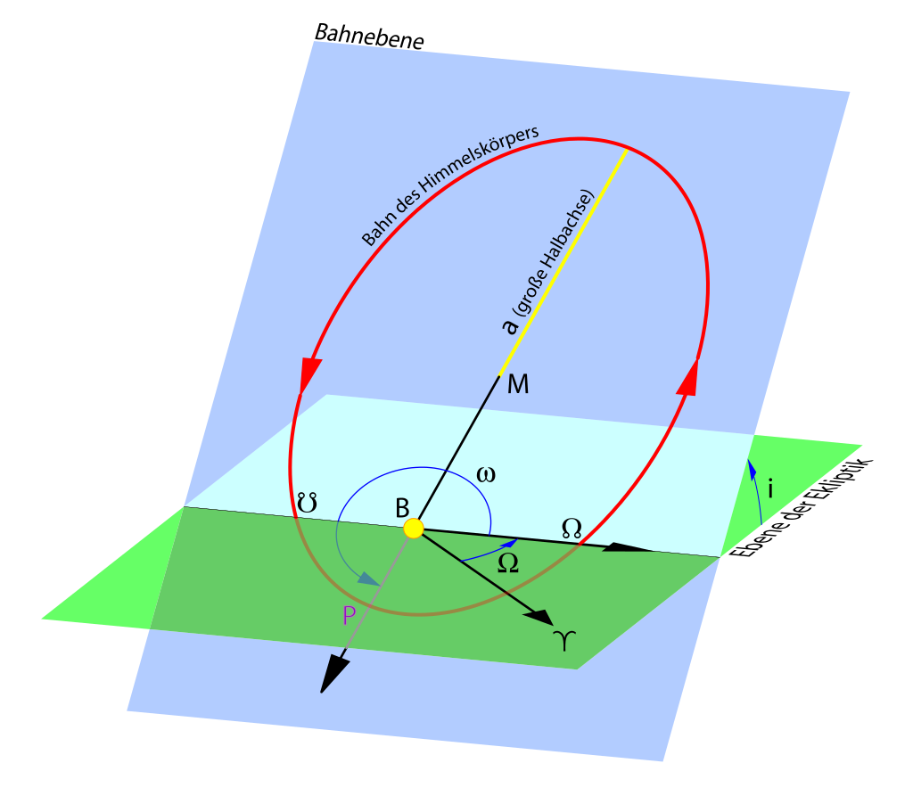

# 軌道の3D空間での描画

6章では、ケプラーの運動法定式と、NASAのデータを利用して、水星が特定の時間に2次元平面上で
どの位置にいるのかを計算してみました。

この章では、水星だけでなく、他の惑星との関係を加味した上で、どの位置にいるのかを計算してみます。

ここで必要になるのは、3つの値があります。

1つめは、昇交点から楕円軌道の近点までをはかった角度である、近点引数(ω)です。
昇交点とは、地球と太陽の軌道がある面 (黄道面) より上(北極側)に軌道が横切る位置のことです。
前回利用した、近日点黄経()は、Ω(後述)+ωで定義されています。つまり、ω=-Ωです。
これは、平面の軌道を回転させるのに利用します。

2つめは、黄道面を中心にしたときに、 対象の天体の軌道面がどれくらい
面と面の間に角度があるかを表す、軌道傾斜角(I)です。これは、平面の軌道を縦方向に回転させるのに利用します。

3つめは、地球と太陽によって作られる春分点を0°として、昇交点まに到達するまでの反時計回りで回転したときの角度である昇交点黄経(Ω)です。

それぞれの関係性は図を見るとわかりやすいです。


軌道要素の図 <sup>[1](#note1)</sup>

## 軸回転

ここでは、3次元空間上に表現するにあたって、6章で求めた2次元の点を3次元上の点に
変換する作業を行います。

3章では、2次元の座標系で、回転操作を行いたいときには以下のような操作を行うことを学びました。
これは、原点を中心に回転を行う操作になります。

```
x' = x cos θ - y sin θ
y' = x sin θ + y cos θ
```

一方で、3次元で回転操作を行うときは、x, y, z のどこかの軸を固定して回転操作を行います。
例えば、z軸を中心に回転操作を行う場合は、以下のように、zは変化させないことにより実現できます。

```
x' = x cos θ - y sin θ
y' = x sin θ + y cos θ
z' = z
```

## 軌道要素の利用

ここで、6章で求めた点を黄道上 (x, y平面)におき、Iの値をΩの値を利用して x,y,z の値を導出します。
6章で利用したデータをもう一度確認し、特定時間時点のIと、Ωの値を求めます。
時間は、前回と同じ2015年1月30日 日本時間9:00時点(ユリウス世紀数 `0.1507871321`)の値を導出します。
こちらの計算方法は、前回の方法と同じく J2000.0 時点の情報に、ユリウス世紀数ごとの変化量とユリウス世紀数を
かけあわせたものを足したものを利用します。

```
               a              e               I                L            long.peri.      long.node.
           AU, AU/Cy     rad, rad/Cy     deg, deg/Cy      deg, deg/Cy      deg, deg/Cy     deg, deg/Cy
-----------------------------------------------------------------------------------------------------------
Mercury   0.38709927      0.20563593      7.00497902      252.25032350     77.45779628     48.33076593
          0.00000037      0.00001906     -0.00594749   149472.67411175      0.16047689     -0.12534081
...
```

- I: 7.00497902 + -0.00594749 * 0.1507871321 = 7.004082215039707 (度)
- Ω: 48.33076593 + -0.12534081 * 0.1507871321 = 48.31186615 (度)

それぞれ、コンピュータで扱うために、弧度法へ変換します。

- I: 7.004082215039707 * π / 180 = 0.12224429573282038 (ラジアン)
- Ω: 48.31186615 * π / 180 = 0.8432011321 (ラジアン)

ωについては、定義から、ω =  - Ω で求めることができるため、
前回利用した値を利用し、

- long.peri () : 77.48199413 (度)

ラジアンに変換し、

- long.peri () : 1.352315909 (ラジアン)

- ω: 1.352315909 - 0.8432011321 = 0.5091147765 (ラジアン)

この3つの角度を利用して、回転を行っていきます。

順番としては、x, y平面上で軌道平面をω回転し、その後、x軸を中心にI傾け、最後にz軸を中心にΩ回転させるという流れになります。

まずは、ωを利用した回転操作です。これは単純に回転の公式を当てはめれば良いのみなので、

```
x' = x cos ω - y sin ω
y' = x sin ω + y cos ω
z' = 0 … まだ平面なので3次元方向にはなにもない
```

という処理になります。この後、x軸を中心にI傾けます。中心となる軸はそのままにするので、以下のようになります。

```
x'' = x' = x cos ω - y sin ω
y'' = y' cos I - z' sin I = (x sin ω + y cos ω) cos I
z'' = y' sin I + z' cos I = (x sin ω + y cos ω) sin I
```


最後に、z軸を中心にΩ回転させます。

```
x''' = x'' cos Ω - y'' sin Ω = (x cos ω - y sin ω) cos Ω - {(x sin ω + y cos ω) cos I} sinΩ
y''' = x'' sin Ω + y'' cos Ω = (x cos ω - y sin ω) sin Ω + {(x sin ω + y cos ω) cos I} cosΩ
z''' =  z'' = (x sin ω + y cos ω) sin I
```

が導出されます。これをx, yからの導出を行いやすくするために整理すると、

```
x''' = x (cos ω cos Ω - sin ω cos I sin Ω) + y (-sin ω cos Ω - cos ω cos I sin Ω)
y''' = x (cos ω sin Ω + sin ω cos I cos Ω) + y (-sin ω sin Ω + cos ω cos I cos Ω)
z''' = x sin ω sin I + y cos ω sin I
```

といった形になります。

6章ででは、平面上の点を以下のように求めましたので、これを利用して、空間上の座標 (黄道座標) を求めていきます。

- x = 0.21226130652594014 (AU)
- y = 0.24885129984675164 (AU)

以下のコードにより求めることができます。

```js
const x = 0.21226130652594014 // au
const y = 0.24885129984675164 // au
const node = 0.8432011321 // rad, Ω
const longPeri = 1.352315909 // rad
const peri = longPeri - node // rad, ω
const I = 0.12224429573282038 // rad

const cosPeri = Math.cos(peri)
const sinPeri = Math.sin(peri)
const cosI = Math.cos(I)
const sinI = Math.sin(I)
const cosNode = Math.cos(node)
const sinNode = Math.sin(node)

console.log(x * (cosPeri * cosNode - sinPeri * cosI * sinNode) + y * (-sinPeri * cosNode - cosPeri * cosI * sinNode))
console.log(x * (cosPeri * sinNode + sinPeri * cosI * cosNode) + y * (-sinPeri * sinNode + cosPeri * cosI * cosNode))
console.log(x * sinPeri * sinI + y * cosPeri * sinI)
```

これにより

- x = -0.19514123612989365
- y = 0.2595611239762158
- z = 0.039112051408966814

という3次元空間上の座標を求めることができました。

# 注釈

- <sup id="note1">1</sup> [https://ja.wikipedia.org/wiki/%E8%BB%8C%E9%81%93%E8%A6%81%E7%B4%A0#/media/%E3%83%95%E3%82%A1%E3%82%A4%E3%83%AB:Bahnelemente.svg](https://ja.wikipedia.org/wiki/%E8%BB%8C%E9%81%93%E8%A6%81%E7%B4%A0#/media/%E3%83%95%E3%82%A1%E3%82%A4%E3%83%AB:Bahnelemente.svg) から引用 ([CC BY-SA 3.0](https://creativecommons.org/licenses/by-sa/3.0/))

# 参考文献

- 長谷川一郎 『[天文計算入門](https://www.amazon.co.jp/%E5%A4%A9%E6%96%87%E8%A8%88%E7%AE%97%E5%85%A5%E9%96%80%E2%80%95%E4%B8%80%E7%90%83%E9%9D%A2%E4%B8%89%E8%A7%92%E3%81%8B%E3%82%89%E8%BB%8C%E9%81%93%E8%A8%88%E7%AE%97%E3%81%BE%E3%81%A7-%E9%95%B7%E8%B0%B7%E5%B7%9D-%E4%B8%80%E9%83%8E/dp/4769908180)』 恒星社, 新装版 2015年 (初版1978年) , pp. 168 - 173

# 参考URL

- [軌道要素 - Wikipedia](https://ja.wikipedia.org/wiki/%E8%BB%8C%E9%81%93%E8%A6%81%E7%B4%A0)
