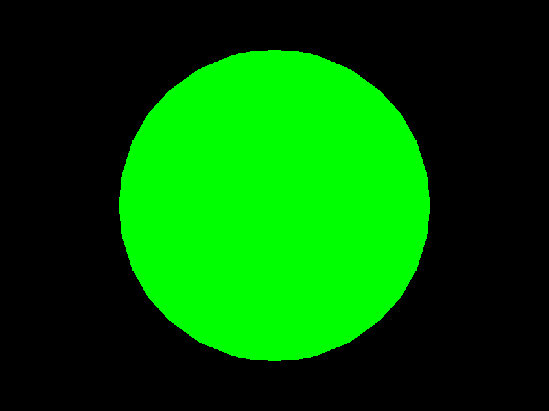

# Three.js での描画 (1)

[Three.js](https://threejs.org/) は、ブラウザ上で3Dコンピューターグラフィックスを描画するためのJavaScriptライブラリです。
WebGLというWeb標準の技術を利用し、JavaScriptからGPUを利用し、リアルタイムにレンダリングを
行うことができます。

この章では、Three.js の基本を学んでいきます。

## 用語解説

- シーン: 3Dで表示したいものを配置する空間オブジェクト
- カメラ: 3D空間の視点や見え方について示すオブジェクト
- レンダラー: シーンや、カメラをコンピューターの画面に表示するためのオブジェクト
- メッシュ: 表示するモデル。形 (球体・直方体など)や、質感 (光があたったときの処理が異なる)をしているすことができる。
- ライト: モデルに陰影をつけるための光源。

## 3D空間の中心に球体を描画する

まずは、かんたんなスクリプトを作成し、画面の中央に球体を描画してみます。
以下のような、HTMLファイルを作ります。

このコースでは、練習のため、cdnjs のファイルを利用しますが、実際に本格的なものを作る場合は[Treee.js](https://threejs.org/)
のサイトからダウンロードしたり、npmのようなパッケージマネージャーで管理したものを使うべきでしょう。(このコースでは取り扱いません)

```html
<html>
<head>
  <meta charset="UTF-8">
  <title>Sample1</title>
</head>
<body>
<script src="https://cdnjs.cloudflare.com/ajax/libs/three.js/r128/three.min.js"></script>
<div id="target"></div>
<script>
  // ここにスクリプトを記載
</script>
</body>
</html>
```

`<script></script>` の中に、スクリプトを記載していきます。

```js
const width = 800;
const height = 600;

// シーン
const scene = new THREE.Scene();

// カメラ
// 視野角, アスペクト比, near, far
// near = この数値より近くにあるものを描画しない
// far = この数値よりも遠くにあるものを描画しない
const camera = new THREE.PerspectiveCamera(45, width / height, 0.1, 1000);

// レンダラー
const renderer = new THREE.WebGLRenderer();
renderer.setSize(width, height);
// target に DOM要素を追加(canvasが作られる)
document.getElementById('target').appendChild(renderer.domElement);

// 球体の形状
// 半径, 横を何分割するか, 縦を何分割するか
// 分割数を小さくするほど荒い球体になる
const sphere = new THREE.SphereGeometry(3, 32, 16);
// 素材
// MeshBasicMaterial は、ライトを無視する
const material = new THREE.MeshBasicMaterial({color: 0x00ff00})
const mesh = new THREE.Mesh(sphere, material);
// 球体をシーンに追加
scene.add(mesh);

camera.position.z = 10;

// シーンとカメラを利用して描画
renderer.render(scene, camera);
```

このような球体が描画されます。



[デモ](sample/sample08_01.html)

シーンにメッシュを追加し、それをカメラで写したものをレンダラーによって描画がし、目的のCanvasにWebGLを通して書き出していくという流れになります。

次回は、特定の時間の太陽と水星、そして地球の3つの天体を書き出してみます。
